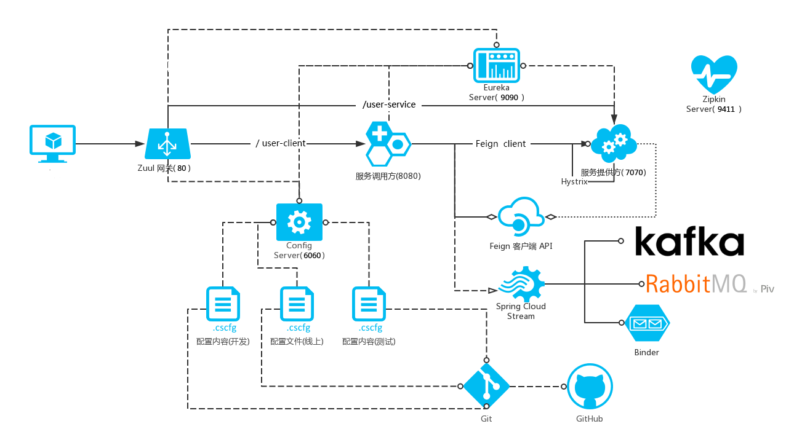

工具:Typora

## 参考资料

[`springcloud官网`](http://cloud.spring.io/spring-cloud-static/Dalston.SR4/single/spring-cloud.html)

[`springcloud中文官网`](https://springcloud.cc/spring-cloud-dalston.html )


## 应用说明



端口配置
[zuul](http://localhost/user-client/user/list?user)  80
[eureka](http://localhost:9090/)   9090
[user-consume](http://localhost:8080/user/list)   8080
[user-provider](http://localhost:7070/user/list)  7070

[config-server](http://localhost:6060/zuul/prod)  6060

[zipkin](http://localhost:9411/zipkin/)   9411

## Config Server

> springcloud中存在一个bootstrap上下文，优先加载bootstrap.properties，用于应用程序上下文的引导阶段，由父Spring ApplicationContext加载，其配置不会被application.properties覆盖

### 1 服务端使用

```xml
<dependency>
            <groupId>org.springframework.cloud</groupId>
            <artifactId>spring-cloud-config-server</artifactId>
</dependency>
```

```java
@EnableConfigServer
```

```properties
# 需要对对应的配置目录执行 git init，然后将目录下的配置文件提交到仓库
spring.cloud.config.server.git.uri = \
  file:///${user.dir}/src/main/resources/configs
server.port = 6060
```

configs目录下 建立配置文件 `zuul.properties zuul-test.properties  zuul-prod.properties`

### 2客户端获取配置

```xml
<dependency>
			<groupId>org.springframework.cloud</groupId>
			<artifactId>spring-cloud-starter-config</artifactId>
</dependency>

```


config client 应用中bootstrap.properties

```properties
### bootstrap 上下文配置
   # 配置服务器 URI   该配置地址可以通过服务发现获取
   spring.cloud.config.uri = http://localhost:6060/
   # 配置客户端应用名称:{application}
   spring.cloud.config.name = zuul
   # profile 是激活配置
   spring.cloud.config.profile = test
   # label 在Git中指的分支名称
   spring.cloud.config.label = master 
```

> config client手动刷新配置   `curl -XPOST localhost/refresh` ,会刷新env中的配置以及`@RefreshScope`中的值


http://localhost:6060/${app}/${profile}/${label}  示例

```json
{
name: "zuul",
profiles: [
"test"
],
label: null,
version: "449d8c4c77bf00cdaa21dec923aff64ef2b55c44",
state: null,
propertySources: [
	{
		name: "file:///D:\ideaproject\git\spring-cloud-demo/config-server-		demo/src/main/resources/configs/zuul-test.properties",
		source: {
			zuul.routes.user-service-consumer: "/user-client/**"
		}
	},
	{
		name: "file:///D:\ideaproject\git\spring-cloud-demo/config-server-demo/src/main/resources/configs/zuul.properties",
		source: {
			zuul.routes.user-service-provider: "/user-service/**"
	}
	}
  ]
}
```

### 3 启用 hateoas

访问端点  `/actuator` ，获取rest资源总入口

```xml
<dependency>
			<groupId>org.springframework.hateoas</groupId>
			<artifactId>spring-hateoas</artifactId>
</dependency>
```

### 4 应用中定时刷新配置

也可以访问config client的 /refresh节点进行手动更新配置

```java
	@Autowired
    private  ContextRefresher contextRefresher;
    @Autowired
    private  Environment environment;
    @Scheduled(fixedRate = 5 * 1000, initialDelay = 3 * 1000)
	// 服务端文件一旦修改(不需要Configserver进行commit) client就会即使获取到最新配置，
    public void autoRefresh() {

        Set<String> updatedPropertyNames = contextRefresher.refresh();
      
        updatedPropertyNames.forEach( propertyName ->
                System.err.printf("[Thread :%s] 当前配置已更新，具体 Key：%s , Value : %s \n",
                        Thread.currentThread().getName(),
                        propertyName,
                        environment.getProperty(propertyName)
                ));
    }
```


## Eureka

### 1 eureka server

```xml
<dependency>
			<groupId>org.springframework.cloud</groupId>
			<artifactId>spring-cloud-starter-eureka-server</artifactId>
</dependency>
```

```java
@EnableEurekaServer
```

```properties
### 取消服务器自我注册  
eureka.client.register-with-eureka=false
### 注册中心的服务器，没有必要再去检索服务
eureka.client.fetch-registry = false
eureka.client.serviceUrl.defaultZone=http://localhost:9090/eureka

```

> 服务端高可用配置  eureka server互相注册

application-peer1.properties

```properties
spring.application.name = spring-cloud-eureka-server
server.port= 9090
eureka.client.register-with-eureka=true
eureka.client.fetch-registry = true
eureka.client.serviceUrl.defaultZone=http://localhost:9091/eureka
```

application-peer2.properties

```properties
spring.application.name = spring-cloud-eureka-server
server.port= 9091
eureka.client.register-with-eureka=true
eureka.client.fetch-registry = true
eureka.client.serviceUrl.defaultZone=http://localhost:9090/eureka
```

通过`--spring.profiles.active=peer1` 和 `--spring.profiles.active=peer2` 分别激活

### 2 eureka client

```xml
<dependency>
			<groupId>org.springframework.cloud</groupId>
			<artifactId>spring-cloud-starter-eureka</artifactId>
</dependency>
```


参考`EurekaClientConfigBean`,可以配置不同区域的服务注册发现地址，默认只配置一个defaultZone

```properties
# 客户端高可用 通过配置多台eureka,逗号分隔，类似amq的failover，此时eureka之间信息不共享 
eureka.client.serviceUrl.defaultZone=\
  http://localhost:9090/eureka,http://localhost:9091/eureka

## 定制监控页实例展示页
eureka.instance.statusPageUrlPath = /health
## 定制监控页应用实例文本
eureka.instance.instanceId = ${spring.application.name}:${server.port}
## 调整注册信息的获取周期
eureka.client.registryFetchIntervalSeconds = 5 
## 调整客户端应用状态信息上报的周期
eureka.client.instanceInfoReplicationIntervalSeconds = 5


```


```java
// 获取服务列表 优先获取指定区域，最后走默认区域
public List<String> getEurekaServerServiceUrls(String myZone) {
		String serviceUrls = this.serviceUrl.get(myZone);
		if (serviceUrls == null || serviceUrls.isEmpty()) {
			serviceUrls = this.serviceUrl.get(DEFAULT_ZONE);
		}
		if (!StringUtils.isEmpty(serviceUrls)) {
			final String[] serviceUrlsSplit = StringUtils.commaDelimitedListToStringArray(serviceUrls);
			List<String> eurekaServiceUrls = new ArrayList<>(serviceUrlsSplit.length);
			for (String eurekaServiceUrl : serviceUrlsSplit) {
				if (!endsWithSlash(eurekaServiceUrl)) {
					eurekaServiceUrl += "/";
				}
				eurekaServiceUrls.add(eurekaServiceUrl);
			}
			return eurekaServiceUrls;
		}

		return new ArrayList<>();
	}
```

> `EurekaClient`代码

`EurekaClient`-->`Applications(1)` ---->`Application(N)`-->`InstanceInfo(N)`

## Ribbon

1     RestTemplate

```java
@LoadBalanced //配置RestTemplate为LoadBalancerClient，本质就是增加LoadBalancerInterceptor
 @Bean
   public RestTemplate restTemplate(){
       // 1 构造RestTemplate时，可以指定ClientHttpRequestFactory， 进行不同httpclient的实现
       // 2 可以指定RestTemplate的拦截器ClientHttpRequestInterceptor，对请求响应进行定制
        RestTemplate restTemplate=new RestTemplate(new HttpComponentsClientHttpRequestFactory());
		// 3定制拦截器列表
//      restTemplate.setInterceptors(List<ClientHttpRequestInterceptor> interceptors);
        return restTemplate;
    }
```

```java
//// 2 调用restTemplate.getForObject方法时,其实里面是封装了List<HttpMessageConverter<?>> messageConverters ，类似之前rest服务端的自动转换，将消息自动序列反序列化
restTemplate.getForObject( "http://user-service-provider/user/list", Collection.class)
```


`   

```reStructuredText
LoadBalancerClient //请求客户端
	RibbonLoadBalancerClient
```

```reStructuredText
LoadBalancerContext //负载均衡上下文
	RibbonLoadBalancerContext
```

    ILoadBalancer (com.netflix.loadbalancer) //负载均衡器
      AbstractLoadBalancer (com.netflix.loadbalancer)
        NoOpLoadBalancer (com.netflix.loadbalancer)
        BaseLoadBalancer (com.netflix.loadbalancer)
            DynamicServerListLoadBalancer (com.netflix.loadbalancer)
                ZoneAwareLoadBalancer (com.netflix.loadbalancer)


    IPing (com.netflix.loadbalancer)
        PingConstant (com.netflix.loadbalancer)
        AbstractLoadBalancerPing (com.netflix.loadbalancer)
            NIWSDiscoveryPing (com.netflix.niws.loadbalancer)   
            DummyPing (com.netflix.loadbalancer)
        NoOpPing (com.netflix.loadbalancer)
        PingUrl (com.netflix.loadbalancer)
        
    IRule (com.netflix.loadbalancer) //核心规则接口
        AbstractLoadBalancerRule (com.netflix.loadbalancer)
            ClientConfigEnabledRoundRobinRule (com.netflix.loadbalancer)
                BestAvailableRule (com.netflix.loadbalancer) //最可用
                PredicateBasedRule (com.netflix.loadbalancer)
                    ZoneAvoidanceRule (com.netflix.loadbalancer)
                    AvailabilityFilteringRule (com.netflix.loadbalancer)//可用性过滤规则
            RoundRobinRule (com.netflix.loadbalancer) //轮训
                WeightedResponseTimeRule (com.netflix.loadbalancer)//RT权重规则
                ResponseTimeWeightedRule (com.netflix.loadbalancer) 
            RandomRule (com.netflix.loadbalancer) // 随机
            RetryRule (com.netflix.loadbalancer)

## Hystrix

[Giuhub](https://github.com/Netflix/Hystrix)   [配置wiki](https://github.com/Netflix/Hystrix/wiki/Configuration)

> 可以是服务端实现(服务降级)，也可以是客户端实现(后端保护)

```xml
<dependency>
			<groupId>org.springframework.cloud</groupId>
			<artifactId>spring-cloud-starter-hystrix</artifactId>
		</dependency>
```


`@EnableHystrix  @EnableCircuitBreaker` 

> 注解方式

```java
@HystrixCommand(
            fallbackMethod = "errorContent",
            commandProperties = {
                    @HystrixProperty(name = "execution.isolation.thread.timeoutInMilliseconds",
                            value = "100")
            }

    )
    public String helloWorld() throws Exception {

        // 如果随机时间 大于 100 ，那么触发容错
        int value = random.nextInt(200);

        System.out.println("helloWorld() costs "+value+" ms.");

        Thread.sleep(value);

        return "Hello,World";
    }

    public String errorContent() {
        return "Fault";
    }

```

> 编程方式

```java
private class HelloWorldCommand extends com.netflix.hystrix.HystrixCommand<String> {

        protected HelloWorldCommand() {
            super(HystrixCommandGroupKey.Factory.asKey("HelloWorld"),
                    100);


        }

        @Override
        protected String run() throws Exception {
            // 如果随机时间 大于 100 ，那么触发容错
            int value = random.nextInt(200);

            System.out.println("helloWorld() costs " + value + " ms.");

            Thread.sleep(value);

            return "Hello,World";
        }

        //容错执行
        @Override
        protected String getFallback() {
            return "Fault";
        }

    }


public static void main(String[] args) {
       return new HelloWorldCommand().execute(); 
    }
```

>hystrix监控

1  [节点数据](http://localhost:8080/hystrix.stream)  `/hystrix.stream`

2 [整合dashboard](http://localhost:8080/hystrix)  `@EnableHystrixDashboard`    `/hystrix`


## Feign

> 申明式 Web 服务客户端：接口声明、Annotation 驱动

### 1启用服务发现

`@EnableEurekaClient`


```java

/**
 * value: 服务器提供方的应用名称
 * fallback:熔断打开时回退实现 必须实现该接口，且声明为bean
 */

@FeignClient(value = "user-service-provider",fallback = FeignUserServiceFallback.class) 
public interface FeignUserService {
    
    @PostMapping("/user/save")
    boolean save(User user);

    @GetMapping("/user/list")
    Collection<User> findAll();

}
```

启动类`@EnableFeignClients(clients = FeignUserService.class)`，会自动生成该接口的代理实现，然后直接调用即可

### 2 不使用服务发现

手动配置服务列表

```properties
#关闭服务发现
ribbon.eureka.enabled = false
# 客户端配置服务列表集
user-service-provider.ribbon.listOfServers = http://localhost:9090,http://localhost:9090,http://localhost:9090
```


## Zuul

### 1 增加 @EnableZuulProxy

### 2 配置路由规则

​	基本模式：`zuul.routes.${app-name} = /${app-url-prefix}/**`

### 3整合Ribbon  不用服务发现

```properties
## Zuul 服务端口
server.port = 80

## Zuul 基本配置模式
# zuul.routes.${app-name}: /${app-url-prefix}/**
## Zuul 配置 user-service-provider 服务调用
zuul.routes.user-service-provider = /user-service/**

## Ribbon 取消 Eureka 整合
ribbon.eureka.enabled = false
## 配置 ${app-name} 的负载均衡服务器列表
user-service-provider.ribbon.listOfServers = \
  http://localhost:7070
```


> 注意：http://localhost:80/user-service/user/list   网关依靠{app-url-prefix} 做定位，forward到后端时只有/user/list 
>
> 

###  4 使用服务发现

```java
@EnableDiscoveryClient
```

```xml
<dependency>
            <groupId>org.springframework.cloud</groupId>
            <artifactId>spring-cloud-starter-eureka</artifactId>
  </dependency>
```


```properties
zuul.routes.user-service-provider = /user-service/**
eureka.client.serviceUrl.defaultZone=\
  http://localhost:9090/eureka
```

### 5服务提供方整合 Hystrix

```java
@EnableHystrix
```

```java
// controller中对需要短路保护的rest接口方法上增加注解，此处模拟超时100ms，然后回退到自
//定义方法abc
@HystrixCommand(fallbackMethod = "abc",
            commandProperties = {
                    @HystrixProperty(name = "execution.isolation.thread.timeoutInMilliseconds",
                            value = "100")
            }
    )
```

### 6 Zuul 增加客户端路由

此时网关发起的请求将  zuul -> user-service-consumer -> user-service-provider

```properties
### Zuul 配置 user-service-consumer 服务调用
zuul.routes.user-service-consumer = /user-client/**
```

### 7整合 Config Server

#### 7.1 路由配置文件提交git仓库

```#properties
#zuul.properties
zuul.routes.user-service-provider = /user-service/**
```

```properties
#zuul-test.properties
zuul.routes.user-service-consumer = /user-client/**
```

```properties
#zuul-prod.properties
zuul.routes.user-service-provider = /user-service/**
zuul.routes.user-service-consumer = /user-client/**
```

#### 7.2 config server向eureka注册

#### 7.3 zuul增加 config client依赖

关掉zuul中 静态配置的路由信息

```properties
#zuul.routes.user-service-provider = /user-service/**
#zuul.routes.user-service-consumer = /user-client/**
```

之前静态写死的配置服务器地址，改为eureka动态发现

由于config 在bootstrap上下文进行，所以需要配置在bootstrap.properties中

```properties
spring.cloud.config.discovery.enabled=true
spring.cloud.config.discovery.serviceId = spring-cloud-config-server
spring.cloud.config.name = zuul
spring.cloud.config.profile = prod
spring.cloud.config.label = master
```

bootstrap上下文优先于application上下文，所以必须将

```properties
eureka.client.serviceUrl.defaultZone=\
  http://localhost:9090/eureka
```

配置移到bootstrap.properties中，以便动态发现配置服务器的时候，完成注册中心的连接

#### 7.4 zuulfilter

只对后端应用进行拦截，自身端点请求不会进行到过滤器逻辑

自定义实现`HostAcessFilter  UserAccessFilter`

zuul默认会组装如下过滤器

```tex
"preDecorationFilter",
"ribbonRoutingFilter",
"simpleHostRoutingFilter",
"servletDetectionFilter",
"formBodyWrapperFilter",
"debugFilter",
"servlet30WrapperFilter",
"sendResponseFilter",
"sendErrorFilter",
"sendForwardFilter"
```

可选的过滤器

```txt
StaticResponseFilter  自身直接响应，类似nginx静态页面
SurgicalDebugFilter   特定请求路由到分隔的调试集群或主机
```


 


## Spring Cloud Stream

### 1 kafka安装初始化

[`下载地址`](http://kafka.apache.org/downloads)

[`命令行操作`](http://kafka.apache.org/documentation/#quickstart)

```shell
cd ${kafka_home}
#由于kafka用到zk，所以修改config/server.properties中zookeeper.connect配置
$ bin/windows/kafka-server-start.bat config/server.properties

#########主题相关操作
# 创建主题testzhj 分区和副本均为1
$ bin/windows/kafka-topics.bat --create --zookeeper 10.11.77.29:2181 --replication-factor 1 --partitions 1 --topic testzhj
> Created topic "testzhj".
# 查看所有主题
$ bin/windows/kafka-topics.bat --list --zookeeper 10.11.77.29:2181
# 查看指定主题的分区数
$ bin/windows/kafka-topics.bat --describe --zookeeper 10.11.77.29:2181 --topic testzhj


######### 收发消息
# 生产者向topic发送消息
$ bin/windows/kafka-console-producer.bat --broker-list localhost:9092 --topic testzhj
# 消费者：接受消息  指定from-beginning参数，会消费到消费者启动之前生产的所有消息
$ bin/windows/kafka-console-consumer.bat --bootstrap-server localhost:9092 --topic testzhj --from-beginning
```

spring-kafka封装了`KafkaTemplate` ,spingboot通过`KafkaAutoConfiguration`完成了KafkaTemplate的自动装配

添加kafka实现

```xml
		<!-- kafka 依赖-->
        <dependency>
            <groupId>org.springframework.cloud</groupId>
            <artifactId>spring-cloud-stream-binder-kafka</artifactId>
        </dependency>
```

### 2理论


```txt
Middleware:一些消息中间件，本文用例使用kafka
Binder：粘合剂，将Middleware和Stream应用粘合起来，不同Middleware对应不同的Binder。
Channel：通道，应用程序通过一个明确的Binder与外界（中间件）通信。
ApplicationCore：Stream自己实现的消息机制封装，包括分区、分组、发布订阅的语义，与具体中间件无关，这会让开发人员很容易地以相同的代码使用不同类型的中间件。
```

> Stream能自动发现并使用类路径中的binder,你也可以引入多个binders并选择使用哪一个，甚至可以在运行时根据不同的channels选择不同的binder实现。


> Netflix OSS搞定业务架构，Spring Cloud Data Flow应对数据架构（stream仅是其中一个子集）

#### 2.1 stream概念

> Source：来源，近义词：Producer、Publisher


> Sink：接收器，近义词：Consumer、Subscriber


> Processor：管道 对于上流而言是 Sink，对于下流而言是 Source  

stream默认提供了这三种channel(对应的channelName分别为output,input)

使用时根据需要配置channel对应的topic，以及其他属性

```properties
#spring.cloud.stream.bindings.${channel-name}.destination = ${kafka.topic}
spring.cloud.stream.bindings.output.destination = ${my.kafka.topic}
spring.cloud.stream.bindings.input.destination = ${my.kafka.topic}
spring.cloud.stream.kafka.binder.zk-nodes=10.11.77.29:2181
```

```java
// 激活需要的channel stream会动态代理对应的Channel实现，然后上层注入使用即可
@EnableBinding({Sink.class/*SubscribableChannel*/,Source.class/*MessageChannel*/})


// 发送消息
@Autowired
@Qualifier(Sink.INPUT) // Bean 名称
private SubscribableChannel subscribableChannel;

// 监听消息
@StreamListener(Sink.INPUT)
public void onMessage(String message){
        System.out.println(">>>>>>>@StreamListener : " + message);
 }
```


1  消费组

`spring.cloud.stream.bindings.<channelName>.group`指定一个组名称，`channelName`是代码中定义好的通道名称,应用显示指点消费组，将创建持久订阅(重启后仍能消费到之前数据)

> 如果应用只用到一个kafka消息源，可以用如下简洁配置

```properties
spring.cloud.stream.kafka.binder.brokers=10.79.96.52:9092
spring.cloud.stream.kafka.binder.zk-nodes=10.79.96.52:2182
spring.cloud.stream.kafka.binder.minPartitionCount=1
spring.cloud.stream.kafka.binder.autoCreateTopics=true
spring.cloud.stream.kafka.binder.autoAddPartitions=false
```

> 用到多kafka时，必须先分别定义channel的binderName，再详细定义该binder的env和type

```properties
spring.cloud.stream.bindings.<channelName>.binder=<binderName>
spring.cloud.stream.binders.${binderName}.type=kafka
spring.cloud.stream.binders.${binderName}.environment.spring.cloud.stream.kafka.binder.b      rokers=10.79.96.52:9092
spring.cloud.stream.binders.${binderName}.environment.spring.cloud.stream.kafka.binder.z	k-nodes=10.79.96.52:2182
```


## Spring Cloud Sleuth

### 1 概述

1.1 

[`谷歌分布式跟踪系统Dapper论文`](http://static.googleusercontent.com/media/research.google.com/zh-CN//archive/papers/dapper-2010-1.pdf)  [`译文`](http://bigbully.github.io/Dapper-translation/)   ---->`Twitter Zipkin `

​	`其他分布式跟踪系统，比如Apache的HTrace，阿里的鹰眼Tracing、京东的Hydra、新浪的Watchman`

分布式跟踪系统要求:`1 对应用透明、低侵入 2低开销、高稳定  3可扩展`

1.2  Sleuth 实现了一种分布式追踪解决方案，其兼容了Zipkin, HTrace和log-based(如elk)追踪

### 2使用

> 仅日志收集 `spring-cloud-starter-sleuth`


> 同时需要Sleuth和Zipkin(http方式)  `spring-cloud-starter-zipkin`


> Stream使用Sleuth  `spring-cloud-sleuth-stream spring-cloud-starter-sleuth` 
>
> ​		同时指定一个流绑定  比如`spring-cloud-stream-binder-kafka`
>
> ​			指定具体实现的跟踪采集 `spring-cloud-sleuth-zipkin-stream`

2.1  大致原理

> A 注册TraceFilter

```tex
1 服务端收到请求
TraceFilter 实现对/*请求拦截埋点
	TraceWebAutoConfiguration进行自动装配完成将TraceFilter包装为FilterRegistrationBean(ServletContextInitializer),然后通过容器钩子ServletContextInitializer#onStartup完成Filter最终的注册
2 客户端发送请求
	TraceRestTemplateInterceptor(ClientHttpRequestInterceptor)
```

> B  委托Tracer进行埋点

```java
public interface Tracer extends SpanAccessor {
    Span createSpan(String name);
    Span createSpan(String name, Span parent);
    Span createSpan(String name, Sampler sampler);
    Span continueSpan(Span span);
    void addTag(String key, String value);
    Span detach(Span span);
    Span close(Span span);
    <V> Callable<V> wrap(Callable<V> callable);
    Runnable wrap(Runnable runnable);
}
/*
*tracer进一步调用SpanLogger来完成MDC 变量的替换或清除
*/
public interface SpanLogger {
    void logStartedSpan(Span parent, Span span);
    void logContinuedSpan(Span span);
    void logStoppedSpan(Span parent, Span span);
}
```

2.2 span 中关键概念:

```txt
cs - 客户端发送 - 客户端已经发出请求。表示span的开始。
sr - 服务器接收 - 服务器端得到请求，并将开始处理它。此时间戳-cs时间戳=网络延迟。
ss - 服务器发送 - 在完成请求处理后（响应发送回客户端时）注释。此时间戳-sr=服务器端处理请求时间。
cr - 客户端接收 - 表示span的结束。客户端已成功接收到服务器响应。此时间戳-cs时间戳=客户端从服务器接收响应所需的整个时间。
```


### 3zipkin 日志收集

zipkin server依赖

```xml
<!-- Zipkin 服务器依赖 -->
<dependency>
    <groupId>io.zipkin.java</groupId>
    <artifactId>zipkin-server</artifactId>
</dependency>

<!-- Zipkin 服务器UI控制器 -->
<dependency>
    <groupId>io.zipkin.java</groupId>
    <artifactId>zipkin-autoconfigure-ui</artifactId>
    <scope>runtime</scope>
</dependency>
```

#### 3.1 http收集

> zipkin server

```java
@EnableZipkinServer
```

> zipkin client

```xml
<!-- Zipkin 客户端依赖  日志埋点且http上报-->
<dependency>
    <groupId>org.springframework.cloud</groupId>
    <artifactId>spring-cloud-starter-zipkin</artifactId>
</dependency>

```

```properties
spring.zipkin.base-url = http://localhost:9411/
```

#### 3.2 cloud stream 收集

> zipkin server  

```xml
<!-- Zipkin 服务器通过Stream 收集跟踪信息 -->
		<dependency>
			<groupId>org.springframework.cloud</groupId>
			<artifactId>spring-cloud-sleuth-zipkin-stream</artifactId>
		</dependency>
		<!-- 使用 Kafka 作为 Stream 服务器 -->
		<dependency>
			<groupId>org.springframework.cloud</groupId>
			<artifactId>spring-cloud-stream-binder-kafka</artifactId>
		</dependency>
```

```java
@EnableZipkinStreamServer
```

> client

```xml
<!-- 添加 sleuth Stream 收集方式 -->
<dependency>
    <groupId>org.springframework.cloud</groupId>
    <artifactId>spring-cloud-sleuth-stream</artifactId>
</dependency>
<dependency>
    <groupId>org.springframework.cloud</groupId>
    <artifactId>spring-cloud-starter-sleuth</artifactId>
</dependency>
<!-- Kafka Binder -->
<dependency>
    <groupId>org.springframework.cloud</groupId>
    <artifactId>spring-cloud-stream-binder-kafka</artifactId>
</dependency>
<!--关掉http上报-->
<!--<dependency>
			<groupId>org.springframework.cloud</groupId>
			<artifactId>spring-cloud-starter-zipkin</artifactId>
</dependency>-->
```

```properties
#禁止应用自动创建topic  这样就不会主动连zk 否则每个应用均需配置	#spring.cloud.stream.kafka.binder.zk-nodes
spring.cloud.stream.kafka.binder.autoCreateTopics=false
```

> 默认使用sleuth topic进行埋点消息的生产与消费

3.2 上报数据样例

```json
{
      "traceId": "bd7a977555f6b982",
      "name": "query",
      "id": "be2d01e33cc78d97",
      "parentId": "ebf33e1a81dc6f71",
      "timestamp": 1458702548786000,
      "duration": 13000,
      "annotations": [
        {
          "endpoint": {
            "serviceName": "zipkin-query",
            "ipv4": "192.168.1.2",
            "port": 9411
          },
          "timestamp": 1458702548786000,
          "value": "cs"
        },
        {
          "endpoint": {
            "serviceName": "zipkin-query",
            "ipv4": "192.168.1.2",
            "port": 9411
          },
          "timestamp": 1458702548799000,
          "value": "cr"
        }
      ],
      "binaryAnnotations": [
        {
          "key": "jdbc.query",
          "value": "select distinct `zipkin_spans`.`trace_id` from `zipkin_spans` join `zipkin_annotations` on (`zipkin_spans`.`trace_id` = `zipkin_annotations`.`trace_id` and `zipkin_spans`.`id` = `zipkin_annotations`.`span_id`) where (`zipkin_annotations`.`endpoint_service_name` = ? and `zipkin_spans`.`start_ts` between ? and ?) order by `zipkin_spans`.`start_ts` desc limit ?",
          "endpoint": {
            "serviceName": "zipkin-query",
            "ipv4": "192.168.1.2",
            "port": 9411
          }
        },
        {
          "key": "sa",
          "value": true,
          "endpoint": {
            "serviceName": "spanstore-jdbc",
            "ipv4": "127.0.0.1",
            "port": 3306
          }
        }
      ]
    },


```


`